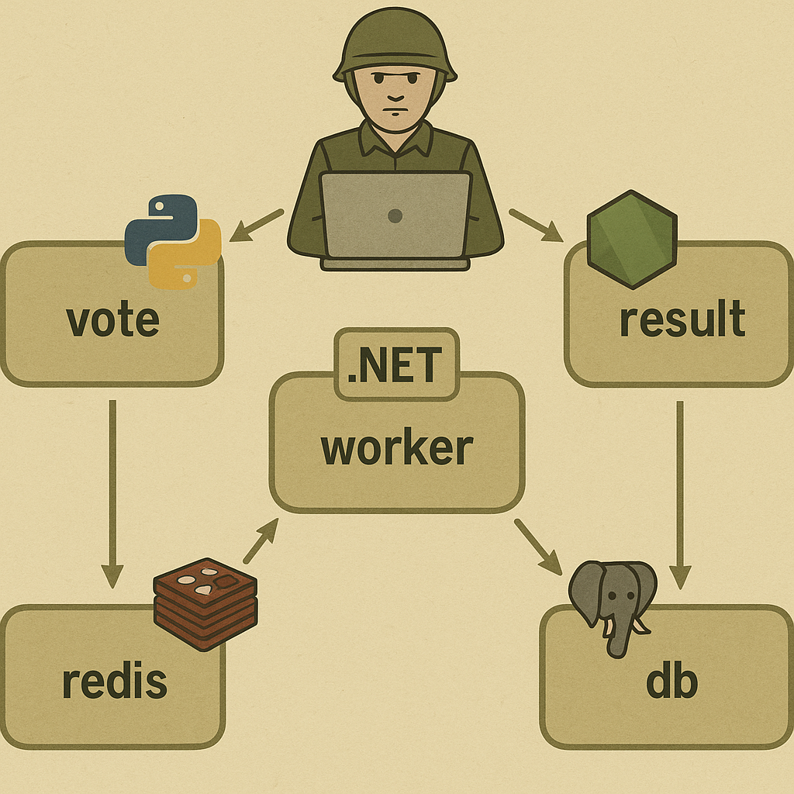
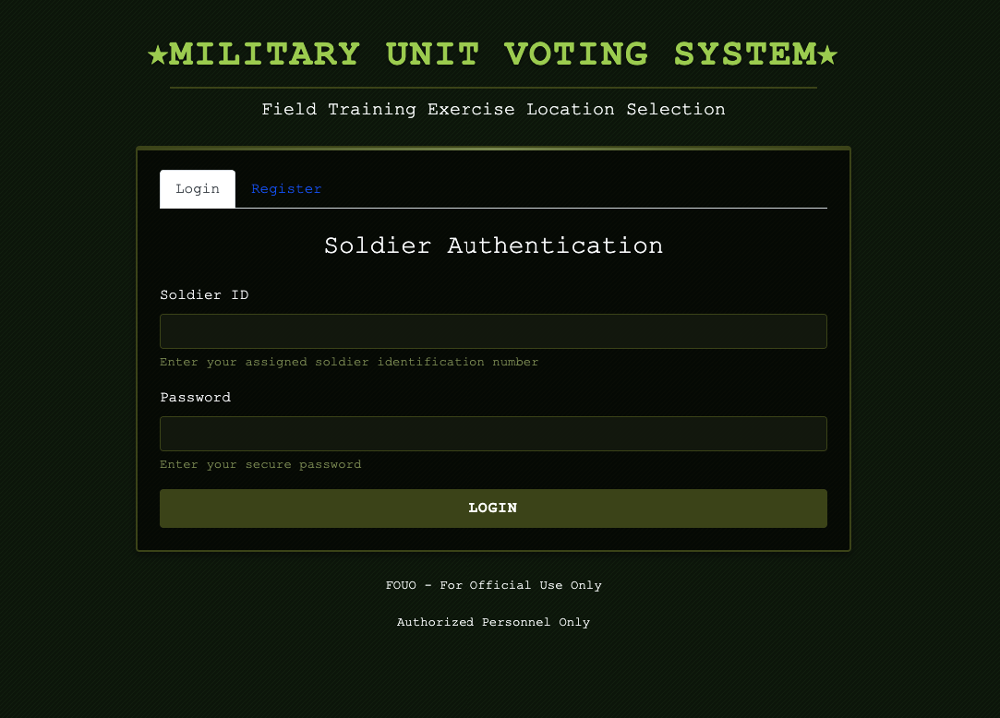
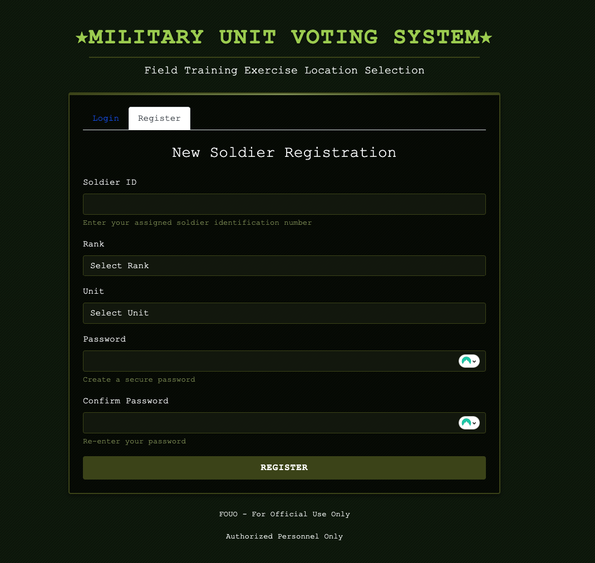
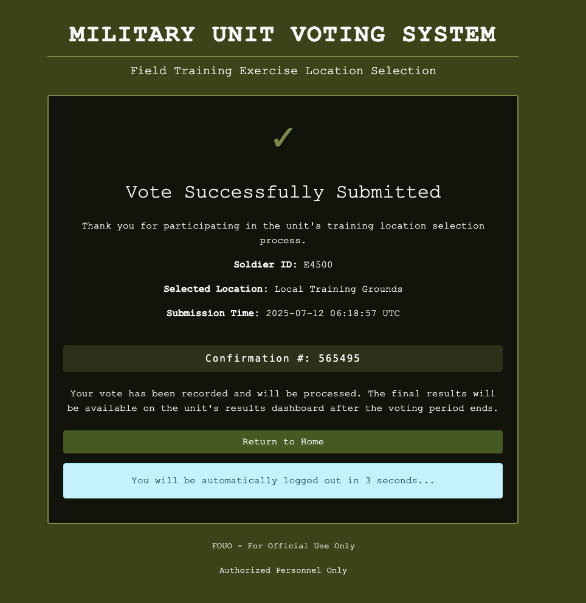
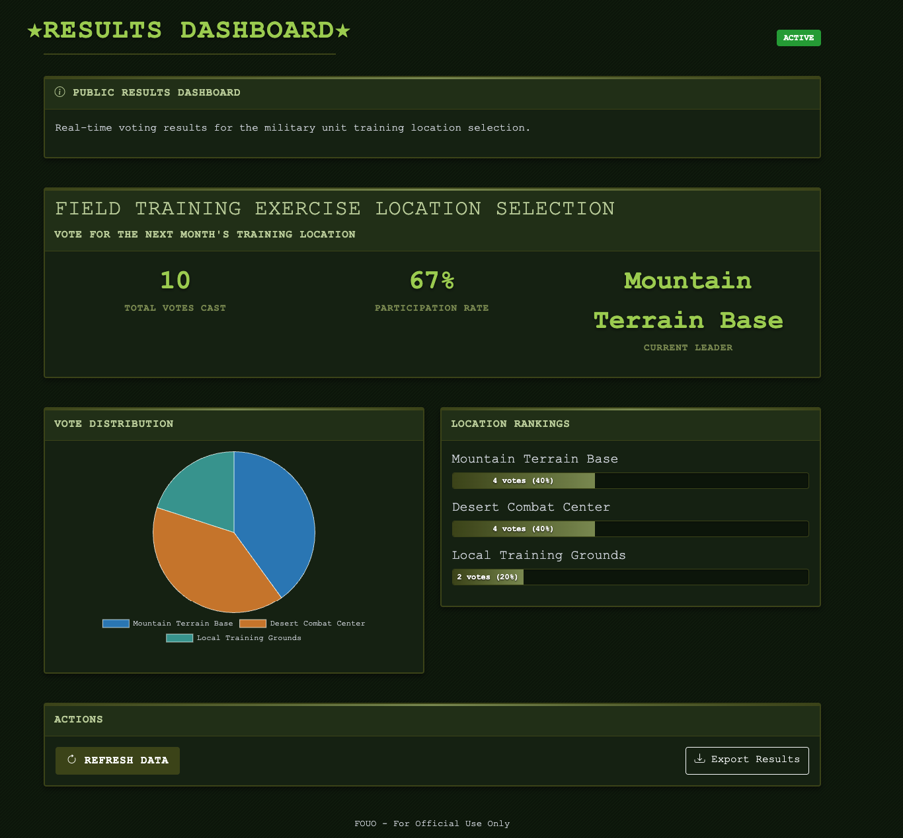

# Military Unit Voting System

[](https://github.com/yourusername/military-unit-voting-system/releases/tag/v1.0.0)
[](LICENSE)
[](docker-compose.yml)
[](k8s/)
[](vote-service/)
[](result-service/)
[](worker-service/)

A distributed microservice application for military unit voting on training exercise locations. This system demonstrates Docker containerization, Kubernetes orchestration, and modern distributed architecture patterns.

## Use Disclaimer

This project is intended solely for testing and learning purposes. It may contain security vulnerabilities and may not conform to security best practices. **Do not use this application in production environments.**

## Project Overview

This application allows soldiers in a military unit to vote on the location for their next field training exercise. The system is built using a microservices architecture with the following components:

1. **Vote Service** (Python/Flask) - Frontend interface for soldiers to register, login, and cast votes
2. **Result Service** (Node.js/Express) - Public results dashboard showing real-time voting statistics
3. **Worker Service** (.NET Core) - Background processing service for vote validation and storage
4. **Redis Service** - Message queue for vote data and temporary storage
5. **Database Service** (PostgreSQL) - Persistent storage for soldiers and processed votes

## Architecture

The application follows a 5-service architecture pattern:


*Figure: System Architecture Diagram (inspired by [Docker Example Voting App](https://github.com/dockersamples/example-voting-app))*

- **Vote Service**: Handles the user interface for soldiers to register, login, and submit their votes. Built with Flask and connects to both Redis (for session management and message queue) and PostgreSQL (for soldier persistence).
- **Result Service**: Provides a fully public real-time dashboard of voting results. Built with Express.js and connects to PostgreSQL. No authentication required.
- **Worker Service**: Processes votes from Redis and stores them in PostgreSQL. Built with .NET Core.
- **Redis**: Acts as a message queue between the Vote Service and Worker Service and provides temporary storage.
- **PostgreSQL**: Stores soldier information and processed votes, providing data for the Result Service.

## Running with Docker Compose

To run the application locally using Docker Compose:

```bash
docker-compose up -d
```

This will start all services and expose the following endpoints:

- Vote Service: http://localhost:5005
- Result Service: http://localhost:5001

### Service Access

- **Vote Service**: Access the voting interface at http://localhost:5005
  - Register with a soldier ID, rank, and unit
  - Login with your soldier ID and password
  - Cast your vote for one of the three training locations


*Figure 1: Soldier Authentication screen for the Vote Service*


*Figure 2: Soldier Registration screen for the Vote Service*


*Figure 3: Vote Confirmation screen showing successful vote submission*

- **Result Service**: View the public results dashboard at http://localhost:5001
  - Real-time vote counts and percentages
  - No authentication required
  - Automatically updates as votes are processed


*Figure 4: Public Results Dashboard showing real-time voting statistics*

## Deploying to Kubernetes

The application includes Kubernetes deployment configurations in the `k8s` directory.

1. Apply the namespace first:

```bash
kubectl apply -f k8s/namespace.yaml
```

2. Apply all resources using kustomize:

```bash
kubectl apply -k k8s/
```

3. Access the services:

```bash
kubectl get services -n military-voting
```

## Service Management

```bash
# Build and run the Vote Service individually
docker-compose build vote
docker-compose up -d vote
```

### Result Service (Node.js/Express)
- Located in the `result-service` directory
- Dependencies: Express.js, PostgreSQL, Socket.IO
- Features: Public dashboard, real-time updates
- Database: Connects to PostgreSQL only

```bash
# Build and run the Result Service individually
docker-compose build result
docker-compose up -d result
```

### Worker Service (.NET Core)
- Located in the `worker-service` directory
- Dependencies: .NET Core, StackExchange.Redis, Npgsql
- Features: Vote processing, database persistence
- Database: Connects to both Redis and PostgreSQL

```bash
# Build and run the Worker Service individually
docker-compose build worker
docker-compose up -d worker
```

## Troubleshooting

### Common Issues

1. **Database Connection Issues**
   - Ensure PostgreSQL is running: `docker-compose ps db`
   - Check connection strings in environment variables

2. **Redis Connection Issues**
   - Ensure Redis is running: `docker-compose ps redis`
   - Verify Redis connection settings

3. **Vote Processing Failures**
   - Check Worker Service logs: `docker-compose logs worker`
   - Verify soldier exists in database before voting

4. **Service Restart**
   - Restart all services: `docker-compose restart`
   - Rebuild a specific service: `docker-compose build <service-name>`

## License

This project is for demonstration purposes only.
